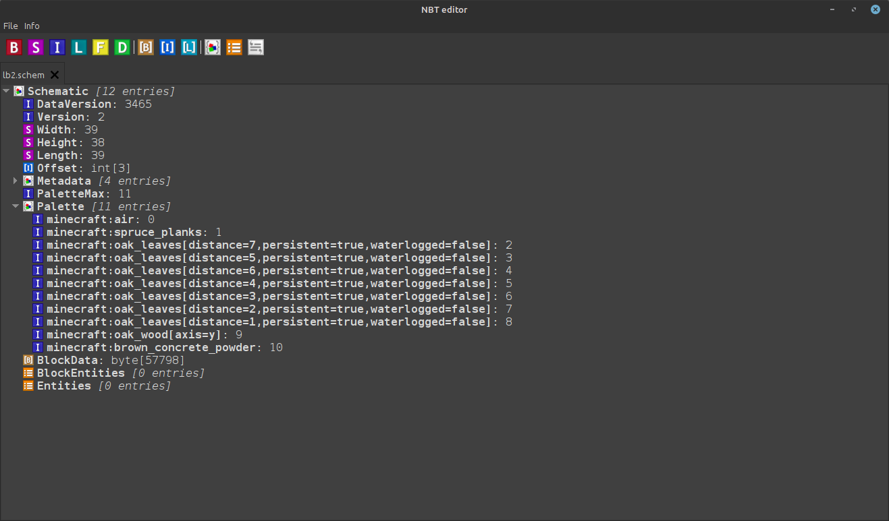

# NBTEditor

An open source cross-platform graphical editor for visualizing and editing NBT (named binary tag) data written in Java.

## Images

## Prerequisites

* Java 17
* Apache Maven

## License

Other work used in this project:
* NBT sprite image from [https://minecraft.fandom.com/wiki/Minecraft_Wiki?file=Nbtsheet.png](https://minecraft.fandom.com/wiki/Minecraft_Wiki?file=Nbtsheet.png) which is licensed under CC-BY 3.0.

The project itself is licensed under the [General Public License V3](https://www.gnu.org/licenses/gpl-3.0.en.html) (GPLv3).
See file [LICENSE](/LICENSE).